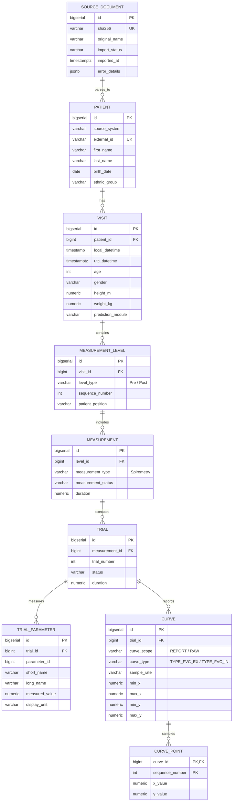
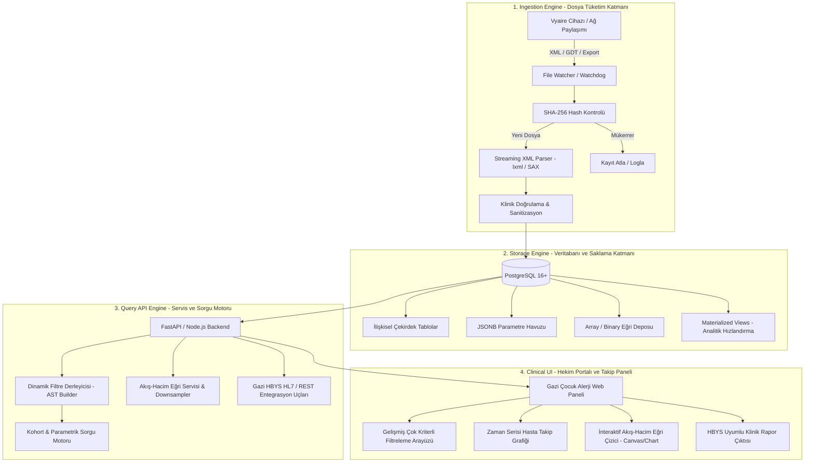

# GAZİ ÜNİVERSİTESİ TIP FAKÜLTESİ ÇOCUK ALERJİ KLİNİĞİ
## Solunum Fonksiyon Testi (SFT) Veri İşleme, Klinik Sorgulama ve Takip Sistemi
### Proje Teknik ve Mimari Şartnamesi (PROJECT_SPEC.md)

---

## 1. Sistemin Amacı ve Klinik Problem Tanımı

### 1.1. Klinik Arka Plan ve Bağlam
Gazi Üniversitesi Tıp Fakültesi Çocuk Alerji ve Astım Bilim Dalı polikliniğinde ve laboratuvarında, çocuk hastaların solunum yolu hastalıklarının (astım, alerjik rinit, reaktif hava yolu hastalıkları, kistik fibrozis vb.) tanı, evreleme ve tedaviye yanıt süreçlerinde **Solunum Fonksiyon Testleri (SFT / Spirometri)** altın standart olarak kullanılmaktadır. Kliniğimizde bu testler Vyaire Medical (eski Jaeger / CareFusion / MasterScreen / Vyntus serisi) cihazları ve SentrySuite yazılım altyapısı ile gerçekleştirilmektedir.

### 1.2. Mevcut Klinik Darboğaz
1. **İlişkisel Veri Eksikliği ve Manuel Tarama:** Cihazlar her test sonrasında zengin sayısal parametreler ve akış-hacim (Flow-Volume) / hacim-zaman eğrileri üretmektedir. Ancak bu veriler ya PDF/RTF rapor formatında hekime iletilmekte ya da kapalı dosya sisteminde ham XML (`NIOSH_XmlExport.V3.0`) olarak birikmektedir.
2. **Parametrik Kohort Sorgulama İmkânsızlığı:** Hekimler ve araştırmacılar geriye dönük klinik araştırmalarda veya riskli hasta takiplerinde şu tür çoklu kriterli parametrik filtrelemeleri yapamamaktadır:
   - *"Son 6 ayda kliniğe başvuran, FEV1 < %80 VE FVC > %90 olan (obstrüktif patern) 6-14 yaş arası hastalar"*
   - *"Bronkodilatör öncesi (Pre) ve sonrası (Post) FEV1 artışı > %12 ve > 200 ml olan (reversibilite pozitif) hastalar"*
   - *"MEF25-75 (veya MFEF) Z-skoru < -1.64 (küçük hava yolu tutulumu) gösteren alerjik astım hastaları"*
   Bu sorguların yapılabilmesi için mevcut durumda asistan ve uzman hekimlerin yüzlerce PDF raporunu tek tek elle açıp incelemesi gerekmektedir. Bu durum ciddi iş gücü kaybına, tanısal gecikmelere ve klinik araştırmaların aksamasına yol açmaktadır.
3. **Gazi HBYS Entegrasyon Kopukluğu:** Cihaz çıktıları ile Gazi Üniversitesi Hastanesi Bilgi Yönetim Sistemi (HBYS) protokol numaraları arasındaki entegrasyonun manuel yürütülmesi mükerrer veya kayıp kayıtlara sebep olmaktadır.

### 1.3. Projenin Hedefi
Vyaire Medical cihazlarının ürettiği ham XML çıktılarının otomatik olarak dinlenmesi (ingestion), doğrulanması, ilişkisel ve analitik bir veritabanına dönüştürülmesi; hekimlerin saniyeler içinde parametrik sorgu çalıştırabileceği, akış-hacim eğrilerini dinamik olarak kıyaslayabileceği ve Gazi HBYS standartlarına tam uyumlu bir **Klinik Karar Destek ve Takip Paneli** sunulmasıdır.

---

## 2. Veri Modeli Hiyerarşisi ve XML-DB Eşleme Kuralları

### 2.1. Hiyerarşik Veri Mimarisi
Vyaire Medical `NIOSH_XmlExport.V3.0` standart ağaç yapısı hiyerarşik olarak aşağıdaki ilişkisel modele normalize edilmiştir:



### 2.2. XML ve Veritabanı Alan Eşleme (Mapping) Tablosu

| Kaynak XML Yolu (XPath / Attribute) | Hedef DB Tablosu | Hedef DB Kolonu | Veri Tipi / Dönüşüm Kuralı | Açıklama / Klinik Önem |
| :--- | :--- | :--- | :--- | :--- |
| `PatientTree/Patient/ExternalId` | `patient` | `external_id` | `VARCHAR(100)` | Gazi HBYS Protokol / Dosya No veya Cihaz ID |
| `PatientTree/Patient/FirstName` | `patient` | `first_name` | `VARCHAR(150)` | Hasta Adı (KVKK maskeleme desteği) |
| `PatientTree/Patient/LastName` | `patient` | `last_name` | `VARCHAR(150)` | Hasta Soyadı |
| `PatientTree/Patient/Birthdate` | `patient` | `birth_date` | `DATE` (ISO 8601'den parse) | Pediatrik persentil hesaplama temeli |
| `PatientTree/Patient/RaceInformation/EthnicGroup` | `patient` | `ethnic_group` | `VARCHAR(100)` | GLI referans denklemleri için etnik grup |
| `VisitTree/Visit/@LocalDate` | `visit` | `local_datetime_raw` / `local_datetime` | `TIMESTAMP` | Cihazın yerel kayıt zamanı |
| `VisitTree/Visit/UtcDate` | `visit` | `utc_datetime` | `TIMESTAMPTZ` | Standart zaman damgası |
| `VisitTree/Visit/Age` | `visit` | `age` | `INTEGER` | Test anındaki yaş |
| `VisitTree/Visit/BiologicalGender` | `visit` | `biological_gender` | `VARCHAR(30)` | Male / Female (Referans denklem için) |
| `VisitTree/Visit/Height` | `visit` | `height_m` | `NUMERIC(8,4)` | Boy (Metre cinsinden) |
| `VisitTree/Visit/Weight` | `visit` | `weight_kg` | `NUMERIC(8,3)` | Kilo (kg cinsinden) |
| `VisitTree/Visit/PredModuleName` | `visit` | `prediction_module` | `VARCHAR(100)` | Örn: GLI 2012, ERS 93, Zapletal |
| `Levels/LevelTree/Level/@Type` | `measurement_level` | `level_type` | `VARCHAR(30)` | `Pre` (Bazal) veya `Post` (Bronkodilatör Sonrası) |
| `Levels/LevelTree/Level/@Sequence` | `measurement_level` | `sequence_number` | `INTEGER` | Seviye sırası |
| `LevelTree/Measurements/Measurement/@MeasurementType` | `measurement` | `measurement_type` | `VARCHAR(100)` | `Spirometry`, `BodyPlethysmography` vb. |
| `Measurement/Duration` | `measurement` | `duration` | `NUMERIC` | Test süresi (saniye) |
| `Measurement/Trials/Trial/@Number` | `trial` | `trial_number` | `INTEGER` | Deneme numarası (0: Best/En iyi, 1..n denemeler) |
| `Trial/Status` | `trial` | `status` | `VARCHAR(100)` | Deneme geçerlilik durumu (`Valid`, `None`) |
| `Trial/Parameters/Parameter/@ParameterId` | `trial_parameter` | `parameter_id` | `BIGINT` | Vyaire parametre kodu (Örn: 65547 = FEV1) |
| `Trial/Parameters/Parameter/@ShortName` | `trial_parameter` | `short_name` | `VARCHAR(50)` | FEV1, FVC, PEF, FEV1%F, FET, MEF25/50/75 |
| `Trial/Parameters/Parameter/LongName` | `trial_parameter` | `long_name` | `VARCHAR(255)` | Parametre tam adı |
| `Trial/Parameters/Parameter/Value` | `trial_parameter` | `measured_value` | `NUMERIC` | Ölçülen değer (Liter, L/s, % vb.) |
| `Trial/Parameters/Parameter/PredictedReference` | `trial_parameter` | `predicted_reference_id`| `BIGINT` | Referans norm id |
| `Trial/Parameters/Parameter/Unit/DisplayUnit/@Name` | `trial_parameter`| `display_unit` | `VARCHAR(100)` | `ISO_LITER`, `LITER_PER_SECOND`, `%` |
| `Trial/ReportCurveData/Curves/Curve/@Type` | `curve` | `curve_type` | `VARCHAR(100)` | `TYPE_FVC_EX`, `TYPE_FVC_IN`, `TYPE_TIFF_EX` |
| `Trial/ReportCurveData/Curves/Curve/@DataType` | `curve` | `data_type` | `VARCHAR(100)` | `SpirFvc`, `SpirTiff` |
| `Trial/ReportCurveData/Curves/Curve/Data` | `curve` / `curve_point` | `raw_data` / `x_value, y_value`| `TEXT` / Ayrıştırılmış satırlar | Boşlukla ayrılmış `x,y` koordinat çiftleri |

---

## 3. Tespit Edilen Mimari Riskler ve Çözüm Stratejileri

Sağlık bilişimi ve büyük veri mimarisi standartları çerçevesinde mevcut veri tabanı şemasında tespit edilen 4 kritik sistemik risk şunlardır:

### 3.1. Risk 1: `trial_parameter` Tablosundaki EAV (Entity-Attribute-Value) Kaynaklı Sorgu Darboğazı
- **Problemin Anatomisi:** Her ölçüm parametresi (`FEV1`, `FVC`, `PEF`, `MFEF`, vb.) dikey olarak ayrı bir satır olarak kaydedilmektedir. Bir hekim *"FEV1 < 2.0 L VE FVC > 3.0 L olan hastaları getir"* sorgusu attığında, ilişkisel veritabanı aynı tablo üzerinde `SELF-JOIN` veya karmaşık `INTERSECT/GROUP BY HAVING` operasyonu yürütmek zorundadır:
  ```sql
  -- Darboğaza yol açan EAV deseni
  SELECT t.id FROM trial t
  JOIN trial_parameter p1 ON t.id = p1.trial_id AND p1.short_name = 'FEV1'
  JOIN trial_parameter p2 ON t.id = p2.trial_id AND p2.short_name = 'FVC'
  WHERE p1.measured_value < 2.0 AND p2.measured_value > 3.0;
  ```
  Her bir ek parametre filtresi sisteme yeni bir JOIN maliyeti getirir. Kliniğin 5 yıllık arşivinde (~20.000 test x 3 deneme x 25 parametre = ~1.5 milyon satır) bu sorgular disk I/O ve CPU darboğazına neden olarak sorgu sürelerini saniyelerden dakikalara çıkarır.
- **Çözüm Stratejisi:**
  1. **Hibrit Genişletilmiş Tablo (Denormalized Core Metrics):** `trial` tablosuna klinikte en sık taranan çekirdek parametreler sütun olarak eklenir (`fev1_val`, `fvc_val`, `fev1_fvc_ratio`, `pef_val`, `fev1_zscore`). EAV tablosu ise sadece nadir veya ikincil parametreler için tutulur.
  2. **JSONB / Document Storage Hibriti:** Her trial kaydına `parameters_json JSONB` alanı eklenerek `GIN` indeksi (`jsonb_path_ops`) tanımlanır. Böylece hekimlerin keyfi parametre filtreleri tek satırda JSON path sorgusu ile mikro-saniyeler mertebesinde taranır.
  3. **Materialized View (Klinik Özet Görünümü):** Günlük/saatlik yenilenen ve her hastanın en iyi (`Best Trial`) değerlerini tek satırda toplayan düzleştirilmiş `mv_clinical_spirometry_summary` oluşturulur.

### 3.2. Risk 2: `curve_point` Tablosundaki Nokta Verisi Patlaması (Massive Coordinate Bloat)
- **Problemin Anatomisi:**
  - Gerçek Vyaire XML incelendiğinde; `ReportCurveData` içinde akış-hacim döngüsü için ~200-400 nokta bulunurken, `RawCurveData` (250 Hz örnekleme, 4 milisaniyede bir kayıt) içerisinde tek bir deneme için **8.000 - 15.000 nokta** bulunmaktadır.
  - Bir ziyarette 3 pre + 3 post = 6 deneme yapıldığı senaryoda, **tek bir hastadan 60.000 - 90.000 satır `curve_point` üretilir**.
  - Yılda 5.000 test yapılan bir merkezde bu tablo 2 yılda **500 Milyon satırı** aşar.
  - Her satır için PK indeksi `(curve_id, sequence_number)`, PostgreSQL tuple overhead (24 byte header), WAL logları ve index B-Tree şişmesi veritabanının Buffer Pool'unu tüketir; Ingestion işlemini felç eder.
- **Çözüm Stratejisi:**
  1. **Ham Koordinatların Array/Binary Paketlenmesi:** Koordinat verileri ilişkisel `curve_point` tablosunda milyonlarca satır olarak tutulmak yerine; `curve` tablosunda `x_points INTEGER[] / REAL[]` ve `y_points INTEGER[] / REAL[]` veya sıkıştırılmış ikili (Binary / Float32Array) blob formatında tutulmalıdır.
  2. **Raw vs. Report İzolasyonu:** Hekimlerin poliklinikte görselleştirdiği eğriler `ReportCurveData` (en fazla 300 nokta) olup çok hafiftir. `RawCurveData` ise arşiv seviyesindedir. Arayüz için yalnızca `curve_scope = 'REPORT'` verisi çekilir.
  3. **LTTB (Largest Triangle Three Buckets) Algoritması:** Frontend'e eğri çizdirilirken gereksiz veri transferini önlemek için ham eğriler görsel kaliteyi bozmadan %80 oranında seyreltilerek (decimation) istemciye gönderilir.

### 3.3. Risk 3: Mükerrer Dosya ve Veri Bütünlüğü (Duplicate Ingestion & Idempotency)
- **Problemin Anatomisi:**
  - Vyaire cihazları ağ klasörüne periyodik export yaparken aynı dosyayı tekrar yazabilir, hekim testi sonradan onaylayıp tekrar export edebilir veya dosya ismi değiştiği halde içerik aynı kalabilir.
  - Sadece dosya adına bakmak yetersizdir. Ayrıca test yarım kalmış veya cihaz tarafından geçersiz (`Status = None`) olarak işaretlenmiş olabilir.
- **Çözüm Stratejisi:**
  1. **Kriptografik Deduplikasyon:** Dosya okunurken ilk adımda SHA-256 özeti hesaplanır ve `source_document.sha256` tablosunda aranır. Hash mevcutsa işlem atomik olarak sonlandırılır (`SKIPPED_DUPLICATE`).
  2. **Klinik İş Mantığı İdempotensi (Business Idempotency):** SHA-256 farklı olsa bile (örn. dosya meta verisi güncellenmiş), `(patient.external_id + visit.utc_datetime)` bileşik anahtarı kontrol edilir. Eğer aynı hastanın aynı saniyedeki ziyareti mevcutsa, bu bir güncelleme (Revision) olarak kabul edilip versiyonlama kuralı işletilir.
  3. **İki Aşamalı Karantina ve İşlem Kuyruğu:** Hatalı XML'ler veya şema dışı dosyalar doğrudan hata fırlatıp akışı durdurmak yerine `error_details` JSONB sütununa kaydedilerek karantina durumuna (`FAILED_QUARANTINE`) alınır.

### 3.4. Risk 4: Pediatrik Normlar (GLI-2012) ve Z-Skoru İhtiyacı
- **Problemin Anatomisi:** Çocuklarda akciğer hacimleri boy, yaş, cinsiyet ve ırka göre logaritmik olarak değişir. Erişkinlerdeki gibi sabit bir FEV1/FVC < 0.70 eşiği çocuklarda kullanılamaz; bu eşik çocuklarda yanlış obstrüksiyon tanısına (overdiagnosis) yol açar. Çocuk göğüs hastalıklarında tanı **Z-Skoru < -1.64 (5. persentil altı / LLN - Lower Limit of Normal)** kuralına dayanır.
- **Çözüm Stratejisi:** Sisteme aktarılan verilerin sadece ham litre değerleri değil; Vyaire içerisindeki Z-skorları ve % predicted değerleri parse edilmeli, eksik kaldığı durumlarda ise GLI (Global Lung Function Initiative) referans hesaplama modülü devreye girmelidir.

---

## 4. Modüler Katman Yapısı (Sistem Mimarisi)

Sistem endüstri standardı 4 ana katmandan oluşmaktadır:



### 4.1. Katman 1: Ingestion Engine (Veri Tüketim ve Ayrıştırma)
- **Watchdog / Poller Servisi:** Vyaire cihazının XML bıraktığı ağ dizinini (SMB/NFS veya yerel klasör) dinler.
- **İdempotent Streaming Parser:** RAM şişmesini önlemek için tüm XML belleğe yüklenmeden stream/event-driven (`iterparse` / SAX) yaklaşımıyla okunur.
- **Transactional Ingestion:** Bir XML'in tüm alt elemanları (`Patient`, `Visit`, `Trials`, `Curves`) tek bir veritabanı `TRANSACTION` bloğu içinde yazılır. Hata durumunda rollback edilerek veri kirliliği önlenir.

### 4.2. Katman 2: Storage Engine (Depolama ve İndeksleme)
- **RDBMS:** PostgreSQL 16+.
- **İndeksleme Stratejisi:**
  - `patient(external_id)` -> B-Tree Hash/Index.
  - `visit(patient_id, local_datetime DESC)` -> Composite B-Tree.
  - `trial_parameter(short_name, measured_value)` -> Composite B-Tree.
  - `trial(fev1_val, fvc_val, fev1_zscore)` -> Partial & Composite Indexler.
  - `curve(trial_id, curve_type, curve_scope)` -> Composite Index.

### 4.3. Katman 3: Query API Engine (Klinik Sorgu Motoru)
- **RESTful Servis Mimarisi:** FastAPI (Python) veya NestJS (Node.js).
- **Dinamik Kriter Motoru:** Hekimin arayüzden seçtiği `AND / OR` filtrelerini güvenli (SQL Injection korumalı), optimize edilmiş SQL sorgularına dönüştüren sorgu motoru.
- **Curve Downsampling:** 10.000 noktalı ham eğri verisini ekranda çizdirilebilecek ~200 piksele indirgeyen yüksek hızlı veri akışı.

### 4.4. Katman 4: Clinical UI (Gazi HBYS Standartlarında Klinik Panel)
- **Tasarım Dili:** Gazi Üniversitesi Hastanesi kurumsal kimliğine uygun (Lacivert/Gazi Mavisi `#003366`, Altın Sarısı `#C5A059`, Beyaz ve Açık Gri temiz medikal arayüz).
- **Hekim Paneli Yetenekleri:**
  - Parametrik filtreleme (ör: `Yaş: 6-12`, `FEV1 < 80%`, `Reversibilite: Pozitif`).
  - Tek tıkla hastanın geçmiş tüm testlerini üst üste bindirerek (Overlay) akış-hacim döngüsündeki iyileşmeyi/kötüleşmeyi gösteren interaktif eğri grafiği.
  - Hasta bazlı FEV1, PEF trend analizi (zaman çizelgesi).
  - Gazi HBYS protokol numarası ile hızlı hasta arama.

---

## 5. Güvenlik, KVKK ve Denetim İsterleri

1. **Özel Nitelikli Sağlık Verisi Koruması:** Sistem 6698 sayılı Kişisel Verilerin Korunması Kanunu (KVKK) ve Sağlık Bakanlığı Bilgi Güvenliği Yönergelerine tam uyumlu olacaktır.
2. **Audit Logging (İz Kaydı):** Hangi hekimin/kullanıcının hangi hastanın test sonucunu, ne zaman sorguladığı ve görüntülediği değiştirilemez denetim kütüklerinde (`audit_log` tablosu) saklanacaktır.
3. **Rol Tabanlı Erişim Kontrolü (RBAC):** Poliklinik Hekimi, Klinik Araştırmacı, Laboratuvar Teknisyeni ve Sistem Yöneticisi rolleri ayrıştırılacaktır. Araştırmacı rolünde hasta kimlik bilgileri anonimleştirilecektir (De-identification / Pseudo-anonymization).

---
*Bu doküman, Gazi Üniversitesi Tıp Fakültesi Çocuk Alerji Kliniği SFT Projesi için resmi teknik şartname ve mimari referans belgesidir.*
